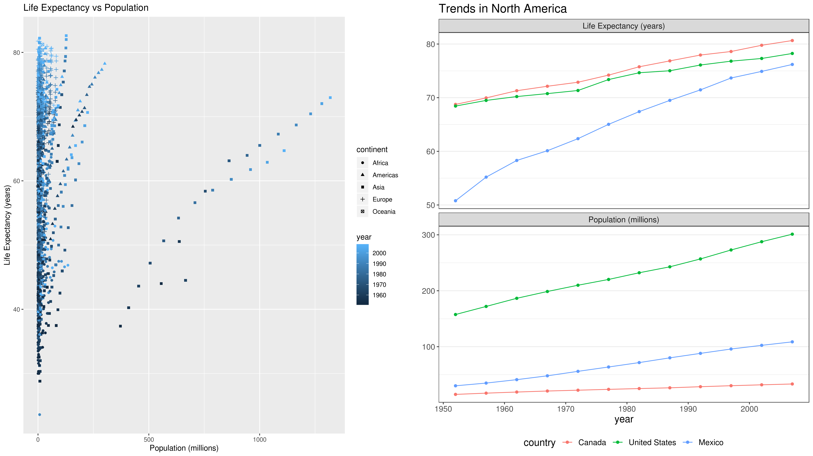

```{r setup, include=FALSE}
knitr::opts_chunk$set(echo = TRUE)
```

## Setup

```{r load}
suppressMessages(library(gapminder))
suppressMessages(library(tidyverse))
suppressMessages(library(DT))
suppressMessages(library(knitr))
suppressMessages(library(gridExtra))
```

## Exercise 1: Explain the value of the `here::here` package

Read through the <a href="https://malco.io/2018/11/05/why-should-i-use-the-here-package-when-i-m-already-using-projects/">blog post by Malcom Barrett</a> where he outlines why one should use the `here::here` package in RStudio projects.

#### Task: **In your own words**, summarize the value of the `here::here` package in 250 words or fewer.

The `here::here` package is very valuable for many reasons. One of the biggest reasons is that it maintains compatibility in directory paths across operating systems, where Unix systems use a `/` but Windows uses `\` for the directory hierarchy. Another reason that the `here::here` package is valuable is its ability to select a directory that acts as a root directory. By using `here()` you can bypass the relative path system and always provide an _absolute_ path from the root. Furthermore, the root itself will be automatically set to the directory containing an `.Rproj` file by default, but can be manually set using `set_here()`, which creates a `.here` file in the directory being set as the root. The use of the `here::here` package resolves many conflicts/problems that could arise from hardcoding absolute _or_ relative directory paths when sharing R scripts. This way, collaborators will never have to change hardcoded aspects of the code and can just run the R scripts just as they were received, removing a lot of unnecessary hassle that comes with project collaboration with multiple collaborators. At the same time, using the `here::here` package increases reproducibility in data analysis, and increases accessibility for script end-users who may not be programmers. To summarize, the `here::here` package not only facilitates many aspects of project collaboration, it also eases the dilemma of hardcoding absolute or relative paths in any R script, regardless of collaboration.

## Exercise 2: Factor management

#### Task: Choose **one** dataset (of your choice) and a variable to explore. After ensuring the variable(s) you're exploring are indeed factors, you should:

1. Drop factor / levels
1. Reorder levels based on knowledge from data

We’ve elaborated on these steps for the gapminder and singer data sets below.

Explore the effects of re-leveling a factor in a tibble by:

1. Comparing the results of `arrange` on the original and re-leveled factor.
1. Plotting a figure of before/after re-leveling the factor (make sure to assign the factor to an _aesthetic_ of your choosing).

These explorations should involve the data, the factor levels, and at least two figures (before and after.

### Elaboration for the gapminder data set

**Drop Oceania.** Filter the Gapminder data to remove observations associated with the `continent` of Oceania. Additionally, remove unused factor levels. Provide concrete information on the data before and after removing these rows and Oceania; address the number of rows and the levels of the affected factors.

#### Filter `gapminder` data to remove observations associated with the `continent` of Oceania.

* After dropping Oceania, the dataframe has 1680 rows, and the `continent` column has 5 levels, with the 5 levels being the 5 continents, including Oceania.
    ```{r}
    no_oceania <- gapminder %>%
      filter(continent != "Oceania")
    
    nrow(no_oceania)
    nlevels(no_oceania$continent)
    levels(no_oceania$continent)
    ```

    ```{r, echo = FALSE}
    datatable(no_oceania, rownames = FALSE, caption = "Gapminder: No Oceania")
    ```

#### Additionally, remove unused factor levels.

* After removing unused factors, the number of rows remains the same as after dropping Oceania, but the levels have decreased to 4, now excluding Oceania from the levels.

    ```{r}
    no_oceania_dropped <- no_oceania %>%
      droplevels()
    
    nrow(no_oceania_dropped)
    nlevels(no_oceania_dropped$continent)
    levels(no_oceania_dropped$continent)
    ```

#### Provide concrete information on the data before and after removing these rows and Oceania; address the number of rows and the levels of the affected factors.

* Gapminder initially had 1704 rows and the `continent` column initially had 5 levels, where the levels were the 5 continents.
    ```{r}
    nrow(gapminder)
    nlevels(gapminder$continent)
    levels(gapminder$continent)
    ```

* Here is a summary table:

  Data | Gapminder | Oceania Dropped | Unused Factors Dropped |
  -----|-----------|-----------------|------------------------|
  number of rows | 1704 | 1680 | 1680 |
  number of levels | 5 | 4 | 4 |
  levels | Africa, Americas, Asia, Europe, Oceania | Africa, Americas, Asia, Europe, Oceania | Africa, Americas, Asia, Europe |

**Reorder the levels of `country` or `continent`.** Use the `forcats` package to change the order of the factor levels, based on summarized information of one of the quantitative variables. Consider experimenting with a summary statistic beyond the most basic choice of the mean/median. Use the `forcats` package in the tidyverse for this, rather than the baseR function `as.factor`.

* Before releveling: 
    ```{r}
    plot <- gapminder %>%
      group_by(continent) %>%
      summarise(var_lifeExp = var(lifeExp)) %>%
      ggplot() +
      geom_col(aes(continent,var_lifeExp)) +
      theme_bw() +
      ylab("Variance of\nLife Expectancy") +
      xlab("Continent") +
      coord_flip() +
      ggtitle("Figure 1")
    ```
    
    ```{r, echo = FALSE}
    print(plot)
    ```

* Using `fct_reorder()`:
    ```{r}
    fct_plot <- gapminder %>%
      group_by(continent) %>%
      summarise(var_lifeExp = var(lifeExp)) %>%
      ggplot() +
      geom_col(aes(fct_reorder(continent, var_lifeExp),var_lifeExp)) +
      theme_bw() +
      ylab("Variance of\nLife Expectancy") +
      xlab("Continent") +
      coord_flip() +
      ggtitle("Figure 2")
    ```
    
    ```{r, echo = FALSE}
    print(fct_plot)
    ```

* Using `arrange()`:
    ```{r}
    arrange_plot <- gapminder %>%
      group_by(continent) %>%
      summarise(var_lifeExp = var(lifeExp)) %>%
      arrange(desc(var_lifeExp), .by_group = TRUE) %>%
      ggplot() +
      geom_col(aes(continent,var_lifeExp)) +
      theme_bw() +
      ylab("Variance of\nLife Expectancy") +
      xlab("Continent") +
      coord_flip() +
      ggtitle("Figure 3")
    ```
    
    ```{r, echo = FALSE}
    print(arrange_plot)
    ```

* As you can see, `arrange()` does not relevel the factors like `fct_reorder()` does, evidenced by no change in the "before releveling" plot and the "using `arrange()`" plot (i.e. Figure 1 and Figure 3 are identical). However, `arrange()` does reorder the dataframe itself, just not releveling the factors.
* Let's verify this by checking the dataframes themselves:
  * Using `fct_reorder()`:
    ```{r}
    fct <- gapminder %>%
      group_by(continent) %>%
      summarise(var_lifeExp = var(lifeExp))
    
    fct$continent <- fct_reorder(fct$continent, fct$var_lifeExp)
    ```
      
      * It seems that, using `fct_order()` does not change the actual ordering of the `var_lifeExp` column:
    ```{r, echo = FALSE}
    kable(fct, caption = "Dataframe Appearance: `fct_order()`")
    ```
      
      * But, that it does change the levels, ordering from lowest to highest `var_lifeExp`:
    ```{r}
    levels(fct$continent)
    ```
      
      * As a final check, replot using the `fct` dataframe:
    ```{r}
    fct_df_plot <- ggplot(fct) +
      geom_col(aes(continent,var_lifeExp)) +
      theme_bw() +
      ylab("Variance of\nLife Expectancy") +
      xlab("Continent") +
      coord_flip() +
      ggtitle("Figure 4")
    ```
    
    ```{r, echo = FALSE}
    print(fct_df_plot)
    ```
    * Figure 2 and Figure 4 are the same, further confirming that `fct_reorder()` relevels the factors.
  * Using `arrange()`:
    ```{r}
    arrange <- gapminder %>%
      group_by(continent) %>%
      summarise(var_lifeExp = var(lifeExp)) %>%
      arrange(var_lifeExp, .by_group = TRUE)
    ```
    
    * It seems that, using `arrange()` does change the actual ordering of the `var_lifeExp` column:
    ```{r, echo = FALSE}
    kable(arrange, caption = "Dataframe Appearance: Using `arrange()`")
    ```
    * But that it does NOT change the levels, as they are still ordered alphabetically instead of by `var_lifeExp`:
    ```{r}
    levels(arrange$continent)
    ```
    * As a final check: replot using the `arrange` dataframe:
    ```{r}
    arrange_df_plot <- ggplot(arrange) +
      geom_col(aes(continent,var_lifeExp)) +
      theme_bw() +
      ylab("Variance of\nLife Expectancy") +
      xlab("Continent") +
      coord_flip() +
      ggtitle("Figure 5")
    ```
    
    ```{r, echo = FALSE}
    print(arrange_df_plot)
    ```
    
    * Figure 1, 3 and Figure 5 are the same, supporting the conclusion that `arrange` does not relevel the factors.
* __Conclusion__: `fct_reorder` relevels the factors, but does not change the appearance of its dataframe, while `arrange()` changes the appearance of its dataframe, but does _not_ relevel the factors.
  * Here is a summary table:

  Figure | Function | Description | Outcome | Equal to |
  -----|-----------|-----------------|-----------------|-----------------
  1 | NA | This is the original plot with no attempt at releveling. | Factors are ordered alphabetically by default | Figure 3, 5 |
  2 | `fct_reorder()` | This is the plot where `fct_reorder()` was used as an `aes` in `ggplot()` | Factors are ordered by `var_lifeExp` | Figure 4
  3 | `arrange()` | This is the plot where `arrange()` was used on the dataframe before piping into `ggplot()` | Factors are _still_ ordered alphabetically by default| Figure 1, 5
  4 | `fct_reorder()` | This is the plot where `fct_reorder()` was used on the factor in the dataframe, and then that dataframe was plotted | Factors are ordered by `var_lifeExp` | Figure 2
  5 | `arrange()` | This is the plot where `arrange()` was used on the dataframe and then that dataframe was plotted | Factors are _still_ ordered alphabetically by default | Figure 1, 3
  
  * Here is a summary figure:
  
    ```{r, echo = FALSE}
    grid.arrange(plot, arrange_plot, arrange_df_plot, fct_plot, fct_df_plot, ncol = 3)
    ```
  
## Exercise 3: File input/output (I/O)
You are expected to create something new, probably by filtering or grouped-summarization of your dataset (for e.g., Singer, Gapminder, or another dataset), export it to disk and then reload it back in using one of the packages above. You should use `here::here()` for reading in and writing out.

With the imported data, play around with factor levels and use factors to order your data with one of your factors (i.e. non-alphabetically). For the I/O method(s) you chose, comment on whether or not your newly created file survived the round trip of writing to file then reading back in.

* Write the data out to `avg_gapminder.csv`:

    ```{r}
    library(here)
    csv_out <- gapminder %>%
      group_by(continent) %>%
      summarize(avglifeExp = mean(lifeExp), avgGDP = mean(gdpPercap), avgPop = mean(pop))
    
    write_csv(csv_out, here::here("hw05", "avg_gapminder.csv"), col_names = TRUE)
    ```

* What `csv_out` looks like:

    ```{r, echo = FALSE}
    kable(csv_out)
    ```

* Read the data back into `csv_in`:
    ```{r}
    csv_in <- read_csv(here::here("hw05", "avg_gapminder.csv"), col_names = TRUE)
    ```

* What `csv_in` looks like: 
    ```{r, echo = FALSE}
    kable(csv_in)
    ```

* In order to play with factors, `continent` must be a factor first. Using the code above to `read_csv()`, the resulting dataframe does not actually contain factors! The `continent` column has been imported as a `character` class instead of `factor`:
    ```{r}
    str(csv_in)
    ```

* To relevel factors, we must make sure `continent` is a factor. There are two ways to do this:
  * Adding additional parameters to `read_csv()`:
    ```{r}
    csv_in <- read_csv(
      here::here("hw05", "avg_gapminder.csv"), 
      col_names = TRUE, 
      cols(
        continent = col_factor(),
        avglifeExp = col_double(),
        avgGDP = col_double(),
        avgPop = col_double()
      )
    )
    levels(csv_in$continent)
    ```

  * Using `factor()`:
    ```{r}
    csv_in$continent <- factor(csv_in$continent)
    levels(csv_in$continent)
    
    ```
  
* Releveling: 
    ```{r}
    csv_in$continent <- fct_reorder(csv_in$continent, csv_in$avgPop)
    levels(csv_in$continent)
    ```

* Since `csv_in` and `csv_out` look identical to one another (with or without factor releveling), the newly created file `avg_gapminder.csv` **DID** survive the round trip of writing to file then reading back in.

## Exercise 4: Visualization design

Go back through your previous assignments and class participation activities and find figures you created prior to the last week of the course. Recreate at least one figure in light of something you learned in the recent class meetings about visualization design and color.

#### Task: Create a side-by-side plot and juxtapose your first attempt (show the original figure as-is) with a revised attempt after some time spent working on it and implementing principles of effective plotting principles. Comment and reflect on the differences.

* Before plot (I was given feedback from one of the TAs that it was too busy/crowded):
    ```{r}
    before_plot <- gapminder %>%
      mutate(million=pop/(10**6)) %>%
      ggplot(aes(x=million,y=lifeExp)) +
      geom_point(aes(shape = continent, colour = year)) +
      ggtitle("Life Expectancy vs Population") +
      xlab("Population (millions)") +
      ylab("Life Expectancy (years)")
    ```
    
    ```{r, echo = FALSE}
    print(before_plot)
    ```

* After plot:
    ```{r}
    data <- gapminder %>%
      mutate(pop=pop/(10**6)) %>%
      filter(country == "Canada" | country == "United States" | country == "Mexico") %>%
      select(c(-gdpPercap)) %>% 
      pivot_longer(cols = c(lifeExp,pop),
                   names_to = "key", 
                   values_to = "value")
    
    data$country <- fct_relevel(data$country,"Canada", "United States", "Mexico") %>%
      droplevels()
    
    after_plot <- data %>%
      ggplot(aes(year,value)) +
      geom_line(aes(colour = country)) + 
      geom_point(aes(colour = country)) +
      facet_wrap(~ key, 
                 ncol = 1, 
                 scale = "free_y",
                 labeller = labeller(key = c(lifeExp = "Life Expectancy (years)", 
                                             pop = "Population (millions)"))) +
      ggtitle("Trends in North America") +
      xlab("year") +
      ylab("") +
      theme_bw() +
      theme(text = element_text(size = 14), 
            panel.grid.major.x = element_blank(), 
            panel.grid.minor.x = element_blank(),
            legend.position="bottom"
      )
    ```

    ```{r, echo = FALSE}
    print(after_plot)
    ```

* Combine the two side by side:

    ```{r,fig.width=10}
    combined <- grid.arrange(before_plot,after_plot, ncol=2)
    ```
    
    ```{r, echo = FALSE}
    print(combined)
    ```

* Noticeable changes for effective visualization:
  * Changes in the data:
    * pivoted the data longer to make use of faceting
    * subsetted the dataset to North American countries to resolve overcrowding
    * factors releveled to reflect North-South geographic location order
  * Changes in the plot:
    * changed title to a less redundant/repetitive title
    * increased overall font size
    * added lines to the points 
    * changed facet labels to replace y-axis labels
      * removed now redundant y-axis labels
    * removed vertical grid lines
    * removed grey background colour


## Exercise 5: Writing figures to file

#### Task: Use `ggsave()` to explicitly save a plot to file. Include the exported plot as part of your repository and assignment.

Then, use `` to load and embed that file into your report. You can play around with various options, such as:

* Arguments of `ggsave()`, such as width, height, resolution or text scaling.
* Various graphics devices, e.g. a vector vs. raster format.
* Explicit provision of the plot object `p` via `ggsave(..., plot = p)`. Show a situation in which this actually matters.

By default, `ggsave()` saves the most recently plot _made using `ggplot()`_. With the code below, `ggsave()` will save `after_plot` (the most recent plot) to `combined.png`. In this case, since `combined` (the plot we want to save) was not plotted directly using `ggplot()`, it is not the plot `ggsave()` chooses to save. Instead `ggsave()` chooses to save `after_plot`. Specifying `plot =` matters _in this case_.

```{r}
ggsave(here::here("hw05","combined.png"), width = 16, height = 9, dpi = 300, device = "png")
```

To save the `combined` plot, `plot = combined` must be specified explicitly:

```{r}
ggsave(here::here("hw05","combined.png"), plot = combined, width = 16, height = 9, dpi = 300, device = "png")
```


